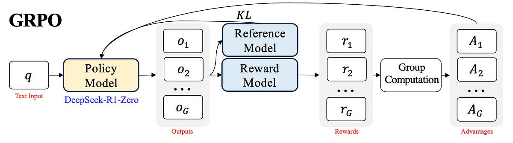

# Core intuition of GRPO
**Author**: [Shirin Yamani](https://github.com/shirinyamani)
### 🥅 **Goal:**
GRPO directly evaluates the model-generated responses by comparing them within groups of generation to optimize policy model, instead of training a separate value model (Critic). This approach leads to significant reduction in computational cost!

### 📱**Application**: 
GRPO can basically be applied to any verifiable task where the correctness of the response can be determined. For instance, in math reasoning, the correctness of the response can be easily verified by comparing it to the ground truth. 

Below is the picture of the GRPO algorithm in a nutshell:



# Steps of GRPO
## 🐾 Step 1) **Group Sampling**:
### **Action:** 
For each question $q$, the model will generate $G$ outputs (group size) from the trained policy:{ ${o_1, o_2, o_3, \dots, o_G}\pi_{\theta_{\text{old}}}$ }, $G=8$ where each $o_i$ represents one completion from the model.
### **Example**:
- **Question** 
	- $q$ : $\text{Calculate}\space2 + 2 \times 6$
- **Output**: we will have $8$ responses; $(G = 8)$	$${o_1:14(correct), o_2:10 (wrong), o_3:16 (wrong), ... o_G:14(correct)}$$
## 🐾 Step 2) **Advantage Calculation**:
### **Reward Distribution:**
Assign a RM score to each of the generated responses based on the correctness $r_i$ *(e.g. 1 for correct response, 0 for wrong response)* then for each of the $r_i$ calculate the following Advantage value 
### **Advantage Value Formula**:
$$A_i = \frac{r_i - \text{mean}(\{r_1, r_2, \ldots, r_G\})}{\text{std}(\{r_1, r_2, \ldots, r_G\})}$$
### **Example**:
for the same example above, imagine we have 8 responses, 4 of which is correct and the rest wrong, therefore;
- Group Average: $mean(r_i) = 0.5$
- Std: $std(r_i) = 0.53$
- Advantage Value:
	- Correct response: $A_i = \frac{1 - 0.5}{0.53}= 0.94$
	- Wrong response: $A_i = \frac{0 - 0.5}{0.53}= -0.94$
### **Meaning**:  
- This standardization (i.e. $A_i$ weighting) allows the model to assess each response's relative performance, guiding the optimization process to favour responses that are better than average (high reward) and discourage those that are worse.  For instance if $A_i > 0$, then the $o_i$ is better response than the average level within its group; and if $A_i < 0$, then the $o_i$ then the quality of the response is less than the average (i.e. poor quality/performance). 
- For the example above, if $A_i = 0.94 \text{(correct output)}$ then during optimization steps its generation probability will be increased. 
## 🐾 Step 3) **Policy Update; Target Function:** 
$$J_{GRPO}(\theta) = \left[\frac{1}{G} \sum_{i=1}^{G} \min \left( \frac{\pi_{\theta}(o_i|q)}{\pi_{\theta_{old}}(o_i|q)} A_i \text{clip}\left( \frac{\pi_{\theta}(o_i|q)}{\pi_{\theta_{old}}(o_i|q)}, 1 - \epsilon, 1 + \epsilon \right) A_i \right)\right]- \beta D_{KL}(\pi_{\theta} || \pi_{ref})$$

## 🔑 **Key Components of the Target function**:
## 📊 **1. Probability Ratio:** $\left(\frac{\pi_{\theta}(o_i|q)}{\pi_{\theta_{old}}(o_i|q)}\right)$ 
Intuitively, the formula compares how much the new model's response probability differs from the old model's response probability while incorporating a preference for responses that improve the expected outcome.
### **Meaning**:
- If $\text{ratio} > 1$, the new model assigns a higher probability to response $o_i$​ than the old model.
- If $\text{ratio} < 1$, the new model assigns a lower probability to $o_i$​ 
## **2. ✂️ Clip Function:** $\text{clip}\left( \frac{\pi_{\theta}(o_i|q)}{\pi_{\theta_{old}}(o_i|q)}, 1 - \epsilon, 1 + \epsilon\right)$ 
Limit the ratio discussed above to be within $[1 - \epsilon, 1 + \epsilon]$ to avoid/control drastic changes or crazy updates and stepping too far off from the old policy. In other words, it limit how much the probability ratio can increase to help maintaining stability by avoiding updates that push the new model too far from the old one.
### **Example** $\space \text{suppose}(\epsilon = 0.2)$
- **Case 1**: if the new policy has a probability of 0.9 for a specific response and the old policy has a probabiliy of 0.5, it means this response is getting reinforeced by the new policy to have higher probability, but within a controlled limit which is the clipping to tight up its hands to not get drastic 
	- $\text{Ratio}: \frac{\pi_{\theta}(o_i|q)}{\pi_{\theta_{old}}(o_i|q)} = \frac{0.9}{0.5} = 1.8  → \text{Clip}\space1.2$ (upper bound limit 1.2) 
- **Case 2**: If the new policy is not in favour of a response (lower probability e.g. 0.2), meaning if the response is not beneficial the increase might be incorrect, and the model would be penalized.
	- $\text{Ratio}: \frac{\pi_{\theta}(o_i|q)}{\pi_{\theta_{old}}(o_i|q)} = \frac{0.2}{0.5} = 0.4  →\text{Clip}\space0.8$ (lower bound limit 0.8)
### **Meaning**:
- The formula encourages the new model to favour responses that the old model underweighted **if they improve the outcome**.
- If the old model already favoured a response with a high probability, the new model can still reinforce it **but only within a controlled limit $[1 - \epsilon, 1 + \epsilon]$, $\text{(e.g., }\epsilon = 0.2, \space \text{so} \space [0.8-1.2])$**.
- If the old model overestimated a response that performs poorly, the new model is **discouraged** from maintaining that high probability.
- Therefore, intuitively, By incorporating the probability ratio, the objective function ensures that updates to the policy are proportional to the advantage $A_i$ while being moderated to prevent drastic changes. T

## **3. 🚩 KL Divergence:**  $\beta D_{KL}(\pi_{\theta} || \pi_{ref})$
In the KL divergence term, the $\pi_{ref}$ is basically the pre-update model’s output, `per_token_logps` and $\pi_{\theta}$ is the new model’s output, `new_per_token_logps`. Theoretically, KL divergence is minimized to prevent the model from deviating too far from its original behavior during optimization. This helps strike a balance between improving performance based on the reward signal and maintaining coherence. In this context, minimizing KL divergence reduces the risk of the model generating nonsensical text or, in the case of mathematical reasoning, producing extremely incorrect answers.

### **Meaning**
- A KL divergence penalty keeps the model’s outputs close to its original distribution, preventing extreme shifts.
- Instead of drifting towards completely irrational outputs, the model would refine its understanding while still allowing some exploration

### **Math Definition**
Recall that KL distance is defined as follows:
$$D_{KL}(P || Q) = \sum_{x \in X} P(x) \log \frac{P(x)}{Q(x)}$$
In RLHF, the two distributions of interest are often the distribution of the new model version, P(x), and a distribution of the reference policy, Q(x).
### **Term** $\beta \space$ in $\beta D_{KL}(\pi_{\theta} || \pi_{ref})$
-  **Higher $\beta$ (Stronger KL Penalty)**
    - More constraint on policy updates. The model remains close to its reference distribution.
    - Can slow down adaptation: The model may struggle to explore better responses.
- **Lower $\beta$ (Weaker KL Penalty)**
    - More freedom to update policy: The model can deviate more from the reference.
    - Faster adaptation but risk of instability: The model might learn reward-hacking behaviors.
	- Over-optimization risk: If the reward model is flawed, the policy might generate nonsensical outputs.
- **Original** [DeepSeekMath](https://arxiv.org/abs/2402.03300) paper set this $\beta= 0.04$

# 🧮 Complete Simple Math Example
## **Question** 
$$\text{Q: Calculate}\space2 + 2 \times 6$$

## **Step 1) Group Sampling**
Generate $(G = 8)$ responses, $4$ of which are correct answer ($14, \text{reward=} 1$) and $4$ incorrect $\text{(reward= 0)}$, Therefore:

$${o_1:14(correct), o_2:10 (wrong), o_3:16 (wrong), ... o_G:14(correct)}$$
## **Step 2) Advantage Calculation**
- Group Average: 
$$mean(r_i) = 0.5$$
- Std: $$std(r_i) = 0.53$$
- Advantage Value:
	- Correct response: $A_i = \frac{1 - 0.5}{0.53}= 0.94$
	- Wrong response: $A_i = \frac{0 - 0.5}{0.53}= -0.94$
## **Step 3) Policy Update**
- Assuming the probability of old policy ($\pi_{\theta_{old}}$) for a correct output $o_1$ is $0.5$ and the new policy increases it to $0.7$ then:
$$\text{Ratio}: \frac{0.7}{0.5} = 1.4  →\text{after Clip}\space1.2 \space (\epsilon = 0.2)$$
- Then when the target function is re-weighted, the model tends to reinforce the generation of correct output, and the $\text{KL Divergence}$  limits the deviation from the reference policy. 

# 💻 Complete pseudo code example 
### 1. Load the Model and get some generation from the model for given prompt/question
```python
import torch
import torch.nn.functional as F
from transformers import AutoModelForCausalLM, AutoTokenizer

# Load the model and tokenizer
model_name = "Qwen/Qwen2-Math-1.5B"
model = AutoModelForCausalLM.from_pretrained(model_name)
tokenizer = AutoTokenizer.from_pretrained(model_name)
model.eval()

# Move model to GPU if available
device = torch.device("cuda" if torch.cuda.is_available() else "cpu")
model.to(device)

# Input prompt
prompt = "Solve y = 2x + 1 for x = 2, y = "  # Correct answer: 5
inputs = tokenizer(prompt, return_tensors="pt", padding=True)
input_ids = inputs["input_ids"].to(device)  # Shape: (1, prompt_len)
attention_mask = inputs["attention_mask"].to(device)

# Step 1: Generate 8 responses (B = 2 groups, G = 4 responses per group)
batch_size, num_generations = 2, 4
outputs = model.generate(
    input_ids=input_ids,  # Shape: (1, prompt_len)
    attention_mask=attention_mask,
    max_new_tokens=1,  # seq_len = 1 (single token per response)
    num_return_sequences=batch_size * num_generations,  # 8 responses total
    do_sample=True,
    top_k=10,
    temperature=0.7,
    pad_token_id=tokenizer.eos_token_id,
    return_dict_in_generate=True,
    output_scores=True
)
```
this initial Generation (Before Any Steps) will output sth like this:
```text
Output 1: 5.0
Output 2: 6.0
Output 3: 7.0
Output 4: 5.0
Output 5: 10.0
Output 6: 2.0
Output 7: 5.0
Output 8: 5.0
```
### Step 2) Calculate the Reward for each of the generated outputs
With GRPO, with the same sample prompt, we generate multiple completions. So for instance, for our prompts of `"Solve y = 2x + 1 for x = 2, y = "` and `Solve y = 2x + 1 for x = 4, y = "` we have two group of generated outputs for the given prompt one is say 
- `[5, 6, 7, 5]` and the other is 
- `[10, 2, 9, 9]` while the correct answer is 5 and 9. 

Note that in practice these reward scores are achieved by a rule-based reward function that assigns rewards based on the correctness of the response or a more complex neural network-based model that can be trained to assign rewards based on the correctness of the response or a mixed of both. But for sake of simplicity let's say our reward per response is 1 if the response is correct and 0 if it is wrong, therefore;  
```python
reward_1 = [1, 0, 0, 1]
reward_2 = [0, 0, 1, 1]
```
next we get the group_wise mean and std of the rewards;

```python
# Shape: (B * G,) = (8,) bc we have 2 groups of 4 generations that we flatten
rewards = torch.tensor([1, 0, 0, 1, 0, 0, 1, 1], dtype=torch.float32) 
num_generations = 4

# Group rewards: Shape (B, G) = 2, 4)
rewards_grouped = rewards.view(-1, num_generations)

# Mean per group: Shape (B,) = (2,)
mean_grouped_rewards = rewards_grouped.mean(dim=1)

# Std per group: Shape (B,) = (2,)
std_grouped_rewards = rewards_grouped.std(dim=1)

# Broadcast to match rewards and normalize: Shape (B * G,) = (8,)
# why we need to broadcast? because we need to calculate the advantage values for each response within the group
mean_grouped_rewards = mean_grouped_rewards.repeat_interleave(num_generations, dim=0)
std_grouped_rewards = std_grouped_rewards.repeat_interleave(num_generations, dim=0)
```
this will output:
```text
Grouped Rewards: tensor([[1., 0., 0., 1.],
                        [0., 0., 1., 1.]])
Mean per group: tensor([0.5000, 0.5000])
Std per group: tensor([0.5774, 0.5774])
Broadcasted Mean: tensor([0.5000, 0.5000, 0.5000, 0.5000, 0.5000, 0.5000, 0.5000, 0.5000])
Broadcasted Std: tensor([0.5774, 0.5774, 0.5774, 0.5774, 0.5774, 0.5774, 0.5774, 0.5774])
```
Now we can calculate the advantage values for each response:
```python
# Advantages: Shape (B * G,) = (8,)
advantages = (rewards - mean_grouped_rewards) / (std_grouped_rewards + 1e-8)
```
this will output:
```text
Advantages: tensor([ 0.8659, -0.8660, -0.8660,  0.8659, -0.8660, -0.8660,  0.8659,  0.8659])
```
which is coming from the Advantage formula above, so:
```text
For reward_1 = [1, 0, 0, 1]:
1 - 0.5 / 0.5774 ≈ 0.8659
0 - 0.5 / 0.5774 ≈ -0.8660
For reward_2 = [0, 0, 1, 1]: Same pattern.
```
however, the shape here is `(B*G,) = (8,)` but in practice, we need to have the shape of `(B, G) = (2, 4)` to match the logits shape, right? Therefore, we need to unsqueeze the advantages tensor to have the shape of `(B*G, 1) = (8, 1)` to match the logits shape.
```python
#Shape (B * G, 1) = (8, 1) to match the logits shape
advantages = advantages.unsqueeze(1)  
```
which will output:
```text
Advantages: tensor([[ 0.8659],
                    [-0.8660],
                    [-0.8660],
                    [ 0.8659],
                    [-0.8660],
                    [-0.8660],
                    [ 0.8659],
                    [ 0.8659]])
```
now we are good, let's move to the next step of updating the policy model based on the advantage values.

### Step 3) Policy Update
```python
# Compute probability ratio between new and old policies
ratio = torch.exp(new_per_token_logps - per_token_logps)  # Shape: (B*G, seq_len) seq_len is the length of the output i.e. the num of generated tokens so here for simplicity let's assume it is 1 # (8, 1)
```
Note that the `per_token_logps` can be achieved by passing the generated outputs to the model and get the logits and then apply the softmax function to get the probabilities `F.softmax(logits, dim=-1)`.
```python
# Clipping Function
eps = self.cliprange  # e.g. 0.2 
pg_losses1 = -advantages * ratio  # Shape: (B*G, seq_len)  #(8, 1)
pg_losses2 = -advantages * torch.clamp(ratio, 1.0 - eps, 1.0 + eps)  # Shape: (B*G, seq_len) #(8, 1)
pg_loss_max = torch.max(pg_losses1, pg_losses2)  # Shape: (B*G, seq_len) #(8, 1)


# Now Combine with KL penalty # Shape: (B*G, seq_len) #(8, 1)
per_token_loss = pg_loss_max + self.beta * per_token_kl  
```

`per_token_kl` can also be calculated as follows:

```python
# Shape: (B*G, seq_len) #(8, 1)
per_token_kl = F.kl_div(F.log_softmax(new_per_token_logps, dim=-1), F.softmax(per_token_logps, dim=-1), reduction="none").sum(dim=-1, keepdim=True)  
```

Complete example can be found [here](./basic_example.py). GRPO is also implemented by the excellent TRL team, you can check the implementation [TRL/GRPO_trainer](https://github.com/huggingface/trl/blob/main/trl/trainer/grpo_trainer.py) for more details.

Happy training! 🚀

# References

TODO

