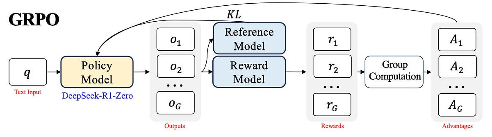

# Înțelegerea Avansată a Optimizării Relative a Politicii de Grup (GRPO) în DeepSeekMath

<Tip>

Această secțiune se scufundă în detaliile tehnice și matematice ale GRPO. A fost scrisă de [Shirin Yamani](https://github.com/shirinyamani).

</Tip>

Să ne aprofundăm înțelegerea GRPO astfel încât să putem îmbunătăți procesul de antrenare al modelului nostru.

GRPO evaluează direct răspunsurile generate de model comparându-le în cadrul grupurilor de generare pentru a optimiza modelul de politică, în loc să antreneze un model de valoare separat (Critic). Această abordare duce la o reducere semnificativă a costului computațional!

GRPO poate fi aplicat la orice sarcină verificabilă unde corectitudinea răspunsului poate fi determinată. De exemplu, în raționamentul matematic, corectitudinea răspunsului poate fi ușor verificată prin compararea acestuia cu adevărul de bază.

Înainte de a ne scufunda în detaliile tehnice, să vizualizăm cum funcționează GRPO la un nivel înalt:

Acum că avem o prezentare vizuală, să descompunem cum funcționează GRPO pas cu pas.

## Algoritmul GRPO

Inovația principală a GRPO este abordarea sa de evaluare și învățare din multiple răspunsuri generate simultan. În loc să se bazeze pe un model de recompensă separat, compară rezultatele din același grup pentru a determina care ar trebui să fie întărite.

Să parcurgem fiecare pas al algoritmului în detaliu:

### Pasul 1: Eșantionarea Grupului

Primul pas este să genereze multiple răspunsuri posibile pentru fiecare întrebare. Aceasta creează un set divers de rezultate care pot fi comparate între ele.

Pentru fiecare întrebare $q$, modelul va genera $G$ rezultate (dimensiunea grupului) din politica antrenată: ${o_1, o_2, o_3, \dots, o_G}\pi_{\theta_{\text{old}}}$, $G=8$ unde fiecare $o_i$ reprezintă o completare din model.

#### Exemplu:

Pentru a face acest lucru concret, să ne uităm la o problemă aritmetică simplă:

- **Întrebarea** $q$ : $\text{Calculează}\space2 + 2 \times 6$
- **Rezultatele** $(G = 8)$: $\{o_1:14 \text{ (corect)}, o_2:16 \text{ (greșit)}, o_3:10 \text{ (greșit)}, \ldots, o_8:14 \text{ (corect)}\}$

Observă cum unele dintre răspunsurile generate sunt corecte (14) în timp ce altele sunt greșite (16 sau 10). Această diversitate este crucială pentru următorul pas.

### Pasul 2: Calculul Avantajului

Odată ce avem multiple răspunsuri, avem nevoie de o modalitate de a determina care sunt mai bune decât altele. Aici intervine calculul avantajului.

#### Distribuția Recompenselor:

În primul rând, atribuim un scor de recompensă fiecărui răspuns generat. În acest exemplu, vom folosi un model de recompensă, dar după cum am învățat în secțiunea anterioară, putem folosi orice funcție care returnează recompense.

Atribuie un scor RM fiecăruia dintre răspunsurile generate bazat pe corectitudine $r_i$ *(de exemplu, 1 pentru răspuns corect, 0 pentru răspuns greșit)* apoi pentru fiecare dintre $r_i$ calculează următoarea valoare de Avantaj

#### Formula Valorii Avantajului:

Ideea cheie a GRPO este că nu avem nevoie de măsuri absolute ale calității - putem compara rezultatele în cadrul aceluiași grup. Aceasta se face folosind standardizarea:

$$A_i = \frac{r_i - \text{mean}(\{r_1, r_2, \ldots, r_G\})}{\text{std}(\{r_1, r_2, \ldots, r_G\})}$$

#### Exemplu:

Continuând cu exemplul nostru aritmetic pentru același exemplu de mai sus, imaginează-ți că avem 8 răspunsuri, 4 dintre care sunt corecte și restul greșite, prin urmare:
- Media Grupului: $mean(r_i) = 0.5$
- Std: $std(r_i) = 0.53$
- Valoarea Avantajului:
	- Răspuns corect: $A_i = \frac{1 - 0.5}{0.53}= 0.94$
	- Răspuns greșit: $A_i = \frac{0 - 0.5}{0.53}= -0.94$

#### Interpretarea:  

Acum că am calculat valorile avantajului, să înțelegem ce înseamnă:

Această standardizare (adică ponderarea $A_i$) permite modelului să evalueze performanța relativă a fiecărui răspuns, ghidând procesul de optimizare să favorizeze răspunsurile care sunt mai bune decât media (recompensă mare) și să descurajeze pe cele care sunt mai rele.  De exemplu, dacă $A_i > 0$, atunci $o_i$ este un răspuns mai bun decât nivelul mediu din grupul său; și dacă $A_i < 0$, atunci $o_i$ atunci calitatea răspunsului este mai mică decât media (adică calitate/performanță slabă).

Pentru exemplul de mai sus, dacă $A_i = 0.94 \text{(rezultat corect)}$ atunci în timpul pașilor de optimizare probabilitatea sa de generare va fi crescută.

Cu valorile avantajului noastre calculate, suntem acum gata să actualizăm politica.

### Pasul 3: Actualizarea Politicii

Pasul final este să folosim aceste valori ale avantajului pentru a actualiza modelul nostru astfel încât să devină mai probabil să genereze răspunsuri bune în viitor.

Funcția țintă pentru actualizarea politicii este:

$$J_{GRPO}(\theta) = \left[\frac{1}{G} \sum_{i=1}^{G} \min \left( \frac{\pi_{\theta}(o_i|q)}{\pi_{\theta_{old}}(o_i|q)} A_i, \text{clip}\left( \frac{\pi_{\theta}(o_i|q)}{\pi_{\theta_{old}}(o_i|q)}, 1 - \epsilon, 1 + \epsilon \right) A_i \right)\right]- \beta D_{KL}(\pi_{\theta} || \pi_{ref})$$

Această formulă ar putea părea intimidantă la început, dar este construită din mai multe componente care fiecare servesc un scop important. Să le descompunem una câte una.

## Componentele Cheie ale Funcției Țintă

Funcția de actualizare GRPO combină mai multe tehnici pentru a asigura o învățare stabilă și eficientă. Să examinăm fiecare componentă:

### 1. Raportul de Probabilitate

Raportul de probabilitate este definit ca:

$\left(\frac{\pi_{\theta}(o_i|q)}{\pi_{\theta_{old}}(o_i|q)}\right)$ 

Intuitiv, formula compară cât de mult diferă probabilitatea de răspuns a modelului nou de probabilitatea de răspuns a modelului vechi în timp ce încorporează o preferință pentru răspunsuri care îmbunătățesc rezultatul așteptat.

#### Interpretarea:
- Dacă $\text{raport} > 1$, modelul nou atribuie o probabilitate mai mare răspunsului $o_i$​ decât modelul vechi.
- Dacă $\text{raport} < 1$, modelul nou atribuie o probabilitate mai mică lui $o_i$​ 

Acest raport ne permite să controlăm cât de mult se schimbă modelul la fiecare pas, ceea ce ne duce la următoarea componentă.

### 2. Funcția de Tăiere

Funcția de tăiere este definită ca:

$\text{clip}\left( \frac{\pi_{\theta}(o_i|q)}{\pi_{\theta_{old}}(o_i|q)}, 1 - \epsilon, 1 + \epsilon\right)$ 

Limitează raportul discutat mai sus să fie în intervalul $[1 - \epsilon, 1 + \epsilon]$ pentru a evita/controla schimbări drastice sau actualizări nebunești și să nu pășească prea departe de politica veche. Cu alte cuvinte, limitează cât de mult poate crește raportul de probabilitate pentru a ajuta la menținerea stabilității prin evitarea actualizărilor care împing modelul nou prea departe de cel vechi.

#### Exemplu $\space \text{să presupunem}(\epsilon = 0.2)$
Să ne uităm la două scenarii diferite pentru a înțelege mai bine această funcție de tăiere:

- **Cazul 1**: dacă noua politică are o probabilitate de 0.9 pentru un răspuns specific și vechea politică are o probabilitate de 0.5, înseamnă că acest răspuns este întărit de noua politică să aibă o probabilitate mai mare, dar într-o limită controlată care este tăierea pentru a-și strânge mâinile să nu devină drastică 
	- $\text{Raport}: \frac{\pi_{\theta}(o_i|q)}{\pi_{\theta_{old}}(o_i|q)} = \frac{0.9}{0.5} = 1.8  → \text{Clip}\space1.2$ (limita superioară 1.2) 
- **Cazul 2**: Dacă noua politică nu este în favoarea unui răspuns (probabilitate mai mică de exemplu 0.2), însemnând dacă răspunsul nu este benefic creșterea ar putea fi incorectă, și modelul ar fi penalizat.
	- $\text{Raport}: \frac{\pi_{\theta}(o_i|q)}{\pi_{\theta_{old}}(o_i|q)} = \frac{0.2}{0.5} = 0.4  →\text{Clip}\space0.8$ (limita inferioară 0.8)
#### Interpretarea:
- Formula încurajează modelul nou să favorizeze răspunsuri pe care modelul vechi le-a subponderat **dacă ele îmbunătățesc rezultatul**.
- Dacă modelul vechi deja favoriza un răspuns cu o probabilitate mare, modelul nou poate totuși să-l întărească **dar doar într-o limită controlată $[1 - \epsilon, 1 + \epsilon]$, $\text{(de exemplu, }\epsilon = 0.2, \space \text{deci} \space [0.8-1.2])$**.
- Dacă modelul vechi a supraestimat un răspuns care performează prost, modelul nou este **descurajat** să mențină acea probabilitate mare.
- Prin urmare, intuitiv, prin încorporarea raportului de probabilitate, funcția obiectiv asigură că actualizările politicii sunt proporționale cu avantajul $A_i$ în timp ce sunt moderate pentru a preveni schimbări drastice.

În timp ce funcția de tăiere ajută la prevenirea schimbărilor drastice, avem nevoie de încă o măsură de protecție pentru a ne asigura că modelul nostru nu deviază prea departe de comportamentul său original.

### 3. Divergența KL

Termenul de divergență KL este:

$\beta D_{KL}(\pi_{\theta} || \pi_{ref})$

În termenul de divergență KL, $\pi_{ref}$ este practic rezultatul modelului pre-actualizare, `per_token_logps` și $\pi_{\theta}$ este rezultatul modelului nou, `new_per_token_logps`. Teoretic, divergența KL este minimizată pentru a preveni modelul să devieze prea departe de comportamentul său original în timpul optimizării. Aceasta ajută să găsească un echilibru între îmbunătățirea performanței bazată pe semnalul de recompensă și menținerea coerenței. În acest context, minimizarea divergenței KL reduce riscul ca modelul să genereze text fără sens sau, în cazul raționamentului matematic, să producă răspunsuri extrem de incorecte.

#### Interpretarea
- O penalitate de divergență KL păstrează rezultatele modelului aproape de distribuția sa originală, prevenind schimbări extreme.
- În loc să derive către rezultate complet iraționale, modelul și-ar rafina înțelegerea în timp ce încă permite unele explorări

#### Definiția Matematică
Pentru cei interesați de detaliile matematice, să ne uităm la definiția formală:

Să ne amintim că distanța KL este definită după cum urmează:
$$D_{KL}(P || Q) = \sum_{x \in X} P(x) \log \frac{P(x)}{Q(x)}$$
În RLHF, cele două distribuții de interes sunt adesea distribuția versiunii noului model, P(x), și o distribuție a politicii de referință, Q(x).

#### Rolul Parametrului $\beta$

Coeficientul $\beta$ controlează cât de puternic impunem constrângerea divergenței KL:

-  **$\beta$ Mai Mare (Penalitate KL Mai Puternică)**
    - Mai multă constrângere asupra actualizărilor politicii. Modelul rămâne aproape de distribuția sa de referință.
    - Poate încetini adaptarea: Modelul ar putea avea dificultăți să exploreze răspunsuri mai bune.
- **$\beta$ Mai Mic (Penalitate KL Mai Slabă)**
    - Mai multă libertate să actualizeze politica: Modelul poate devia mai mult de la referință.
    - Adaptare mai rapidă dar risc de instabilitate: Modelul ar putea învăța comportamente de hack-uire a recompenselor.
	- Risc de supra-optimizare: Dacă modelul de recompensă este defectuos, politica ar putea genera rezultate fără sens.
- **Originala** [DeepSeekMath](https://arxiv.org/abs/2402.03300) lucrare a setat acest $\beta= 0.04$

Acum că înțelegem componentele GRPO, să vedem cum funcționează împreună într-un exemplu complet.

## Exemplu Lucrat cu GRPO

Pentru a ne solidifica înțelegerea GRPO, să parcurgem un exemplu complet de la început la sfârșit.

### Problema Exemplu

$$\text{Î: Calculează}\space2 + 2 \times 6$$

### Pasul 1: Eșantionarea Grupului

În primul rând, generăm multiple răspunsuri din modelul nostru:

Generează $(G = 8)$ răspunsuri, $4$ dintre care sunt răspunsul corect ($14, \text{recompensă=} 1$) și $4$ incorecte $\text{(recompensă= 0)}$, Prin urmare:

$${o_1:14(corect), o_2:10 (greșit), o_3:16 (greșit), ... o_G:14(corect)}$$

### Pasul 2: Calculul Avantajului

Apoi, calculăm valorile avantajului pentru a determina care răspunsuri sunt mai bune decât media:

- Media Grupului: 
$$mean(r_i) = 0.5$$
- Std: $$std(r_i) = 0.53$$
- Valoarea Avantajului:
	- Răspuns corect: $A_i = \frac{1 - 0.5}{0.53}= 0.94$
	- Răspuns greșit: $A_i = \frac{0 - 0.5}{0.53}= -0.94$

### Pasul 3: Actualizarea Politicii

În final, actualizăm modelul nostru pentru a întări răspunsurile corecte:

- Presupunând că probabilitatea vechii politici ($\pi_{\theta_{old}}$) pentru un rezultat corect $o_1$ este $0.5$ și noua politică o crește la $0.7$ atunci:
$$\text{Raport}: \frac{0.7}{0.5} = 1.4  →\text{după Clip}\space1.2 \space (\epsilon = 0.2)$$
- Apoi când funcția țintă este re-ponderată, modelul tinde să întărească generarea rezultatului corect, și $\text{Divergența KL}$ limitează deviația de la politica de referință.

Cu înțelegerea teoretică la locul ei, să vedem cum poate fi implementat GRPO în cod. 